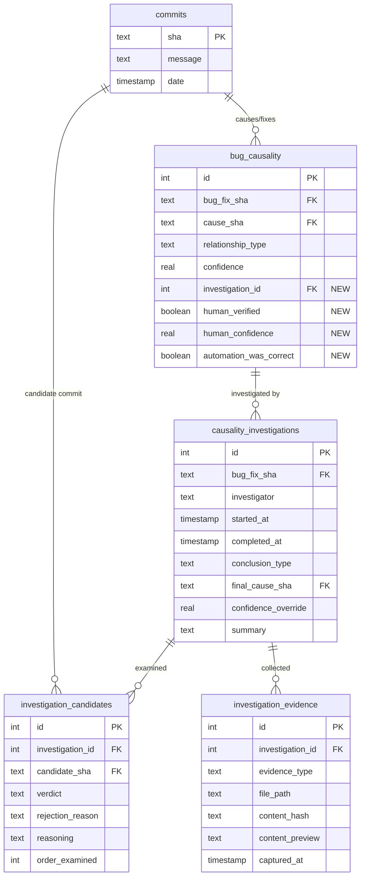

# Plan: Interactive Research Data Model Extension

> **Status**: ✅ Completed
> **Created**: 2025-01-31
> **Completed**: 2025-01-31
> **Author**: Architect Mode

## Implementation Summary

This plan has been fully implemented. The interactive research data model extension is now available for use.

### What Was Delivered

| Phase                      | Description                                                    | Status      |
| -------------------------- | -------------------------------------------------------------- | ----------- |
| Phase 1: Schema Migration  | New tables, enums, and columns added                           | ✅ Complete |
| Phase 2: Query Layer       | CRUD operations for investigations                             | ✅ Complete |
| Phase 3: CLI Commands      | `investigate`, `verify`, `feedback`, `calibration`, `patterns` | ✅ Complete |
| Phase 4: Web UI            | Investigation panel in commit detail view                      | ✅ Complete |
| Phase 5: Learning Feedback | Export, calibration, and pattern analysis                      | ✅ Complete |

### Key Files Added/Modified

| File                               | Description                                                                                |
| ---------------------------------- | ------------------------------------------------------------------------------------------ |
| `src/db/schema.ts`                 | Added `causalityInvestigations`, `investigationCandidates`, `investigationEvidence` tables |
| `src/db/queries/investigations.ts` | CRUD operations for investigation sessions                                                 |
| `src/db/queries/causality.ts`      | Added feedback recording and accuracy queries                                              |
| `src/cli/investigate.ts`           | Interactive investigation CLI command                                                      |
| `src/cli/verify.ts`                | Quick verification CLI command                                                             |
| `src/cli/feedback.ts`              | Automation accuracy statistics                                                             |
| `src/cli/calibration.ts`           | Confidence calibration analysis                                                            |
| `src/cli/patterns.ts`              | Rejection pattern analysis                                                                 |

### Documentation

- **[GUIDE-investigative-analysis.md](GUIDE-investigative-analysis.md)** - Comprehensive user guide for conducting investigations
- **[README.md](../README.md)** - Updated with investigation CLI commands and schema documentation

### Deviations from Original Plan

1. **Evidence storage**: Implemented hybrid approach - content preview stored directly, full content referenced in `analysis_cache` via `content_hash`
2. **Multi-investigator support**: Fully supported with separate investigation records per investigator
3. **Backward compatibility**: Existing `verifiedAt`/`verifiedBy` fields retained; new `human_verified` populated from existing data during migration

---

## Overview

This plan extends the commit-analysis data model to support interactive research of bug causality. The goal is to record human investigation sessions so they can:

1. Improve the quality of subsequent automated analysis
2. Provide audit trails for causality decisions
3. Enable feedback loops for confidence calibration

## Current State

The existing [`bugCausality`](../src/db/schema.ts) table has basic verification support:

```typescript
// Existing fields in bugCausality
verifiedAt: integer("verified_at", { mode: "timestamp" }),
verifiedBy: text("verified_by"),
analysisMethod: text("analysis_method"),
notes: text("notes"),
confidence: real("confidence"),
```

**Limitations:**

- No record of what was examined during verification
- No capture of rejected candidates (why certain commits were ruled out)
- No structured feedback to improve automated methods
- No evidence artifacts (blame output, diffs examined)

---

## Proposed Schema Changes

### Entity Relationship Diagram



---

## New Tables

### 1. `causality_investigations`

Records human investigation sessions for a bug fix commit.

| Column                | Type      | Constraints                | Description                                                        |
| --------------------- | --------- | -------------------------- | ------------------------------------------------------------------ |
| `id`                  | integer   | PK, auto-increment         |                                                                    |
| `bug_fix_sha`         | text      | FK → commits.sha, NOT NULL | The bug fix being investigated                                     |
| `investigator`        | text      | NOT NULL                   | Username or email of investigator                                  |
| `started_at`          | timestamp | NOT NULL                   | When investigation began                                           |
| `completed_at`        | timestamp |                            | When investigation concluded                                       |
| `conclusion_type`     | enum      |                            | One of: `confirmed`, `rejected`, `inconclusive`, `new_cause_found` |
| `final_cause_sha`     | text      | FK → commits.sha           | Root cause determined by human (may differ from automation)        |
| `confidence_override` | real      |                            | Human-assigned confidence (0.0-1.0)                                |
| `summary`             | text      |                            | Freeform investigation notes                                       |

**Indexes:**

- `causality_investigations_bug_fix_sha_idx` on `bug_fix_sha`
- `causality_investigations_investigator_idx` on `investigator`
- `causality_investigations_conclusion_type_idx` on `conclusion_type`

---

### 2. `investigation_candidates`

Commits examined during an investigation, including those ruled out.

| Column             | Type    | Constraints                                         | Description                                                    |
| ------------------ | ------- | --------------------------------------------------- | -------------------------------------------------------------- |
| `id`               | integer | PK, auto-increment                                  |                                                                |
| `investigation_id` | integer | FK → causality_investigations.id, NOT NULL, CASCADE |                                                                |
| `candidate_sha`    | text    | FK → commits.sha, NOT NULL                          | Commit that was considered                                     |
| `verdict`          | enum    | NOT NULL                                            | One of: `root_cause`, `contributing`, `ruled_out`, `uncertain` |
| `rejection_reason` | text    |                                                     | Why commit was ruled out (valuable for training)               |
| `reasoning`        | text    |                                                     | Human explanation for verdict                                  |
| `order_examined`   | integer |                                                     | Sequence in which candidate was examined                       |

**Indexes:**

- `investigation_candidates_investigation_id_idx` on `investigation_id`
- `investigation_candidates_verdict_idx` on `verdict`
- Unique constraint on `(investigation_id, candidate_sha)`

---

### 3. `investigation_evidence`

Artifacts and git outputs examined during investigation.

| Column             | Type      | Constraints                                         | Description                                             |
| ------------------ | --------- | --------------------------------------------------- | ------------------------------------------------------- |
| `id`               | integer   | PK, auto-increment                                  |                                                         |
| `investigation_id` | integer   | FK → causality_investigations.id, NOT NULL, CASCADE |                                                         |
| `evidence_type`    | enum      | NOT NULL                                            | One of: `blame`, `diff`, `bisect`, `log`, `manual_note` |
| `file_path`        | text      |                                                     | Specific file examined (if applicable)                  |
| `content_hash`     | text      |                                                     | Reference to cached content in `analysis_cache`         |
| `content_preview`  | text      |                                                     | First ~500 characters for quick reference               |
| `captured_at`      | timestamp | NOT NULL                                            | When evidence was captured                              |

**Indexes:**

- `investigation_evidence_investigation_id_idx` on `investigation_id`
- `investigation_evidence_evidence_type_idx` on `evidence_type`

---

## Modifications to Existing Tables

### `bug_causality` - Add Learning Feedback Fields

```typescript
// New columns to add:
investigationId: integer("investigation_id")
    .references(() => causalityInvestigations.id),
humanVerified: integer("human_verified", { mode: "boolean" }).default(false),
humanConfidence: real("human_confidence"), // Override if human disagrees
automationWasCorrect: integer("automation_was_correct", { mode: "boolean" }),
```

| Column                   | Type       | Description                                                |
| ------------------------ | ---------- | ---------------------------------------------------------- |
| `investigation_id`       | integer FK | Link to full investigation record                          |
| `human_verified`         | boolean    | Whether a human has reviewed this link                     |
| `human_confidence`       | real       | Human-assigned confidence (if different from `confidence`) |
| `automation_was_correct` | boolean    | Explicit feedback: was the automated result correct?       |

---

## Enum Definitions

```typescript
// New enums to add to schema.ts

export const conclusionTypes = [
	"confirmed", // Human confirmed automated causality
	"rejected", // Human determined automated causality was wrong
	"inconclusive", // Human could not determine causality
	"new_cause_found", // Human found a different root cause
] as const

export const candidateVerdicts = [
	"root_cause", // This commit is the root cause
	"contributing", // This commit contributed but isn't primary cause
	"ruled_out", // This commit was considered but ruled out
	"uncertain", // Could not determine
] as const

export const evidenceTypes = [
	"blame", // git blame output
	"diff", // git diff output
	"bisect", // git bisect session
	"log", // git log output
	"manual_note", // Investigator's note
] as const
```

---

## Implementation Tasks

### Phase 1: Schema Migration

- [x] Add new enum definitions to `schema.ts`
- [x] Create `causality_investigations` table definition
- [x] Create `investigation_candidates` table definition
- [x] Create `investigation_evidence` table definition
- [x] Add new columns to `bug_causality` table
- [x] Generate migration with `pnpm db:generate`
- [x] Test migration with `pnpm db:migrate`

### Phase 2: Query Layer

- [x] Create `src/db/queries/investigations.ts`
    - `createInvestigation()`
    - `completeInvestigation()`
    - `addCandidate()`
    - `addEvidence()`
    - `getInvestigationsForBugFix()`
    - `getInvestigationWithDetails()`
- [x] Update `src/db/queries/causality.ts`
    - Add `linkToInvestigation()`
    - Add `recordHumanFeedback()`
    - Add `getAutomationAccuracy()` - aggregate feedback stats

### Phase 3: CLI Commands

- [x] `pnpm cli investigate --commit <sha>` - Start interactive investigation
- [x] `pnpm cli verify --commit <sha>` - Quick verify/reject automated result
- [x] `pnpm cli feedback --stats` - Show automation accuracy statistics

### Phase 4: Web UI

- [x] Investigation detail view in commit page
- [x] "Start Investigation" button for unverified causality links
- [x] Evidence capture during investigation (auto-save blame/diff output)
- [x] Candidate examination workflow

### Phase 5: Learning Feedback

- [x] Export investigation data for analysis
- [x] Confidence calibration report (automated vs human confidence)
- [x] Rejection reason analysis (common patterns automation misses)
- [x] Consider automated retraining based on feedback (deferred - foundation laid with data export)

---

## Benefits

1. **Audit Trail** - Full record of how causality decisions were made
2. **Knowledge Capture** - Preserve expert reasoning for future reference
3. **Automation Improvement** - Structured feedback to tune confidence scores
4. **Blind Spot Detection** - Track `new_cause_found` to identify what automation misses
5. **Quality Metrics** - Measure `automation_was_correct` rate over time

---

## Open Questions (Resolved)

1. **Storage of evidence content** - Should we store full git output or just references?

    - ✅ **Resolution**: Hybrid approach - store content preview (first ~500 chars) directly for quick reference, full content stored in `analysis_cache` referenced by `content_hash`

2. **Multi-investigator support** - Should multiple people be able to investigate the same bug fix?

    - ✅ **Resolution**: Fully supported - each investigator gets their own investigation record. No automatic conflict resolution; teams should review divergent conclusions manually.

3. **Integration with existing `verifiedAt`/`verifiedBy`** - Deprecate or keep?
    - ✅ **Resolution**: Fields retained for backward compatibility. Migration populates `human_verified` from existing `verifiedAt` values.

---

## Files Modified

| File                                   | Changes                                                |
| -------------------------------------- | ------------------------------------------------------ |
| `src/db/schema.ts`                     | ✅ Added new tables and enums, modified `bugCausality` |
| `src/db/queries/investigations.ts`     | ✅ New file - investigation CRUD                       |
| `src/db/queries/causality.ts`          | ✅ Added feedback-related functions                    |
| `src/types.ts`                         | ✅ Exported new types                                  |
| `src/cli/investigate.ts`               | ✅ New file - investigation CLI                        |
| `src/cli/verify.ts`                    | ✅ New file - quick verification CLI                   |
| `src/cli/feedback.ts`                  | ✅ New file - accuracy statistics                      |
| `src/cli/calibration.ts`               | ✅ New file - confidence calibration                   |
| `src/cli/patterns.ts`                  | ✅ New file - rejection pattern analysis               |
| `src/cli/index.ts`                     | ✅ Registered new commands                             |
| `README.md`                            | ✅ Documented new commands and workflow                |
| `docs/GUIDE-investigative-analysis.md` | ✅ New file - comprehensive user guide                 |

---

## Acceptance Criteria

- [x] New tables created with proper indexes and foreign keys
- [x] Investigation sessions can be started, updated, and completed
- [x] Candidates can be added with verdicts and reasoning
- [x] Evidence artifacts can be captured and retrieved
- [x] Human feedback is recorded and queryable
- [x] Automation accuracy can be calculated from feedback data
- [x] Existing functionality remains unchanged
